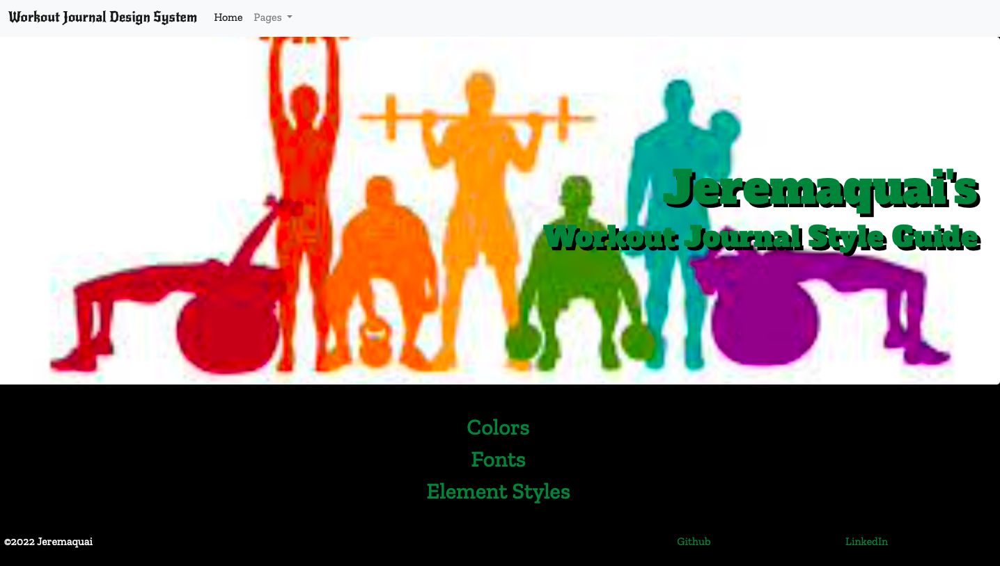
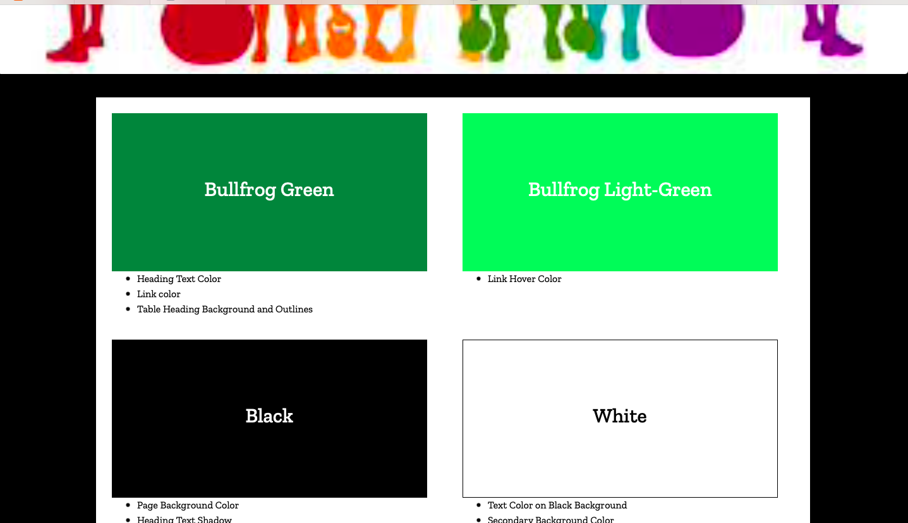

<!--
*** Thanks for checking out the Best-README-Template. If you have a suggestion
*** that would make this better, please fork the repo and create a pull request
*** or simply open an issue with the tag "enhancement".
*** Don't forget to give the project a star!
*** Thanks again! Now go create something AMAZING! :D
-->

<!-- PROJECT SHIELDS -->
<!--
*** I'm using markdown "reference style" links for readability.
*** Reference links are enclosed in brackets [ ] instead of parentheses ( ).
*** See the bottom of this document for the declaration of the reference variables
*** for contributors-url, forks-url, etc. This is an optional, concise syntax you may use.
*** https://www.markdownguide.org/basic-syntax/#reference-style-links
-->
[![Contributors][contributors-shield]][contributors-url]
[![Forks][forks-shield]][forks-url]
[![Stargazers][stars-shield]][stars-url]
[![Issues][issues-shield]][issues-url]
[![MIT License][license-shield]][license-url]
[![LinkedIn][linkedin-shield]][linkedin-url]

<!-- PROJECT LOGO -->
 

  

<h3 align="center">Workout Journal Design System</h3>

  

    Layout Template for my Workout Journal Page
     
    <a href="https://github.com/jeremaquai/workout_journal_design_system"><strong>Explore the docs »</strong></a>
     
     
    <a href="https://github.com/jeremaquai/workout_journal_design_system">View Demo</a>
    ·
    <a href="https://github.com/jeremaquai/workout_journal_design_system/issues">Report Bug</a>
    ·
    <a href="https://github.com/jeremaquai/workout_journal_design_system/issues">Request Feature</a>
  

<!-- TABLE OF CONTENTS -->

  
Table of Contents

  <ol>
    <li>
      <a href="#about-the-project">About The Project</a>
      <ul>
        <li><a href="#built-with">Built With</a></li>
      </ul>
    </li>
    <li>
      <a href="#getting-started">Getting Started</a>
      <ul>
        <li><a href="#prerequisites">Prerequisites</a></li>
        <li><a href="#installation">Installation</a></li>
      </ul>
    </li>
    <li><a href="#usage">Usage</a></li>
    <li><a href="#roadmap">Roadmap</a></li>
    <li><a href="#contributing">Contributing</a></li>
    <li><a href="#license">License</a></li>
    <li><a href="#contact">Contact</a></li>
    <li><a href="#acknowledgments">Acknowledgments</a></li>
  </ol>

<!-- ABOUT THE PROJECT -->
## About The Project

[![Product Name Screen Shot][product-screenshot]](https://jeremaquai.github.io/workout_journal_design_system/)

(<a href="#top">back to top</a>)

### Built With

* [HTML 5](https://en.wikipedia.org/wiki/HTML5)
* [CSS 3](https://en.wikipedia.org/wiki/CSS)
* [Bootstrap](https://getbootstrap.com/)

(<a href="#top">back to top</a>)

<!-- GETTING STARTED -->

<!-- USAGE EXAMPLES -->
## Usage

This page is used as aa reference page for layout and design of my workout journal page

   

(<a href="#top">back to top</a>)

<!-- ROADMAP -->
## Roadmap

- [Color Page](https://jeremaquai.github.io/workout_journal_design_system/colors.html)
- [Fonts Page](https://jeremaquai.github.io/workout_journal_design_system/fonts.html)
- [Element Styles Page](https://jeremaquai.github.io/workout_journal_design_system/element_styles.html)

See the [open issues](https://github.com/jeremaquai/workout_journal_design_system/issues) for a full list of proposed features (and known issues).

(<a href="#top">back to top</a>)

<!-- CONTRIBUTING -->
## Contributing

Contributions are what make the open source community such an amazing place to learn, inspire, and create. Any contributions you make are **greatly appreciated**.

If you have a suggestion that would make this better, please fork the repo and create a pull request. You can also simply open an issue with the tag "enhancement".
Don't forget to give the project a star! Thanks again!

1. Fork the Project
2. Create your Feature Branch (`git checkout -b feature/AmazingFeature`)
3. Commit your Changes (`git commit -m 'Add some AmazingFeature'`)
4. Push to the Branch (`git push origin feature/AmazingFeature`)
5. Open a Pull Request

(<a href="#top">back to top</a>)

<!-- LICENSE -->
## License

Distributed under the MIT License. See `LICENSE.txt` for more information.

(<a href="#top">back to top</a>)

<!-- CONTACT -->
## Contact

Your Name - [@twitter_handle](https://twitter.com/twitter_handle) - jeremaquai@gmail.com.com

Project Link: [https://github.com/jeremaquai/workout_journal_design_system](https://github.com/jeremaquai/workout_journal_design_system)

(<a href="#top">back to top</a>)

<!-- ACKNOWLEDGMENTS -->
## Acknowledgments

* 
* 
* 

(<a href="#top">back to top</a>)

<!-- MARKDOWN LINKS & IMAGES -->
<!-- https://www.markdownguide.org/basic-syntax/#reference-style-links -->
[contributors-shield]: https://img.shields.io/github/contributors/jeremaquai/workout_journal_design_system.svg?style=for-the-badge
[contributors-url]: https://github.com/jeremaquai/workout_journal_design_system/graphs/contributors
[forks-shield]: https://img.shields.io/github/forks/jeremaquai/workout_journal_design_system.svg?style=for-the-badge
[forks-url]: https://github.com/jeremaquai/workout_journal_design_system/network/members
[stars-shield]: https://img.shields.io/github/stars/jeremaquai/workout_journal_design_system.svg?style=for-the-badge
[stars-url]: https://github.com/jeremaquai/workout_journal_design_system/stargazers
[issues-shield]: https://img.shields.io/github/issues/jeremaquai/workout_journal_design_system.svg?style=for-the-badge
[issues-url]: https://github.com/jeremaquai/workout_journal_design_system/issues
[license-shield]: https://img.shields.io/github/license/jeremaquai/workout_journal_design_system.svg?style=for-the-badge
[license-url]: https://github.com/jeremaquai/workout_journal_design_system/blob/master/LICENSE.txt
[linkedin-shield]: https://img.shields.io/badge/-LinkedIn-black.svg?style=for-the-badge&logo=linkedin&colorB=555
[linkedin-url]: https://linkedin.com/in/jeremiah-sparks-0ba36a239
[product-screenshot]: resources/images/workout_journal_design_system_screenshot.png
